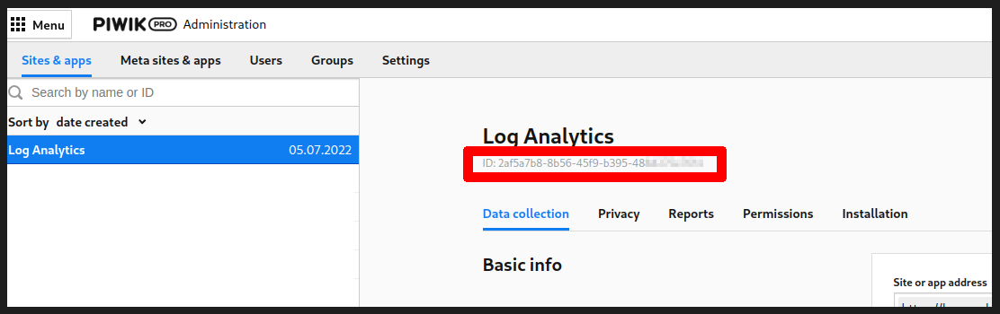

# Piwik PRO Server Log Analytics

Import your web server logs to Piwik PRO.

## Requirements

* Python 3.6+.
* Piwik PRO >= 16+, all the versions, including Cloud, Core and On-Premises are supported

## Getting started

1. Download this git repository `git clone git@github.com:PiwikPRO/log-analytics.git`. The script uses only python standard library, so no external packages are required. Alternatively you can download our PyPi package - `pip install piwik-pro-log-analytics`.
2. Generate Client ID and Client Secret for communication with Piwik PRO API - docs on how to do this can be found on [developers.piwik.pro](https://developers.piwik.pro/en/latest/data_collection/other_integrations/web_log_analytics.html)
3. You are now ready to import your web server's access logs into Piwik PRO:
  * `piwik_pro_log_analytics/import_logs.py --client-id <client-id> --client-secret <client-secret> --url=<my-organization>.piwik.pro /path/to/access.log`
  * If you installed log analytics via `pip`, instead of `piwik_pro_log_analytics/import_logs.py` use `piwik_pro_log_analytics`
  * If the code fails, saying, that your log format doesn't contain hostname - you must decide what App you'd like to track to. You can find App ID in Piwik PRO UI> Administration> Sites & apps>. After that, use `--idsite <app-id>` flag to tell the importer which App you'd like to track to.

## More usage instructions
More usage instructions can be found on [developers.piwik.pro](https://developers.piwik.pro/en/latest/data_collection/other_integrations/web_log_analytics.html)

## License

Log-analytics is released under the GPLv3 or later.  Please refer to  [LEGALNOTICE](LEGALNOTICE) for copyright and trademark statements and [LICENSE.txt](LICENSE.txt) for the full text of the GPLv3.

